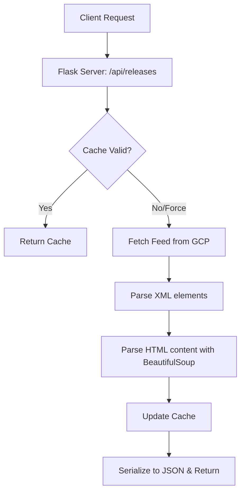
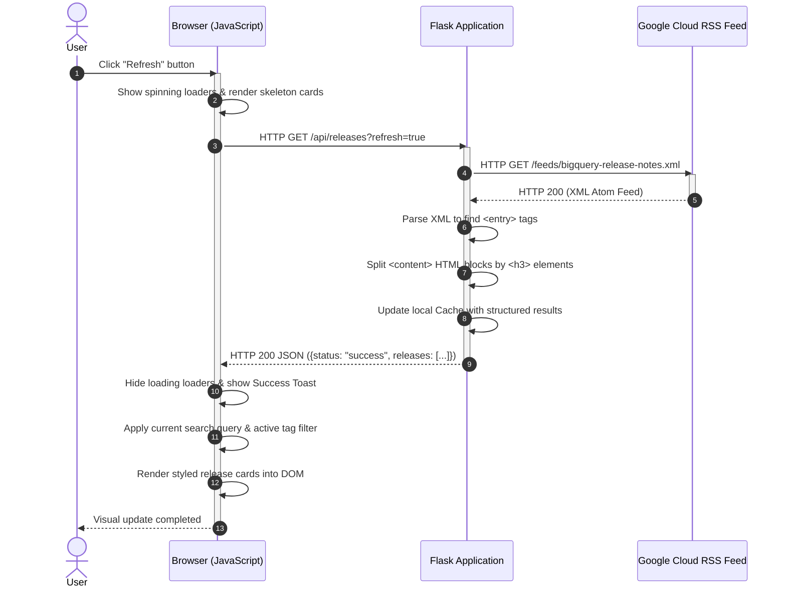

# BigQuery Release Notes Tracker & Tweet Composer

A premium web application built using Python Flask, vanilla HTML5, CSS3, and JavaScript that tracks BigQuery release notes and provides an interactive dashboard with filtering, search, and a direct Tweet composer tool.

## Key Features

1. **Live XML Feed Fetcher & Parser**: Automatically scrapes, parses, and formats the official BigQuery Release Notes Atom Feed (`https://docs.cloud.google.com/feeds/bigquery-release-notes.xml`) in real-time.
2. **In-Memory Caching**: Caches feed contents for 10 minutes (or on-demand bypass) to avoid repetitive external requests, providing sub-millisecond response times.
3. **Sub-Item Release Splitting**: Intelligently separates combined daily release logs (e.g. standard daily logs with multiple `<h3>` headings) into individual update cards sorted by release categories.
4. **Client-Side Live Filtering**: Filter instantly by update types (`Feature`, `Changed`, `Issue`, `Deprecated`) and search updates using real-time keywords.
5. **Interactive Tweet Composer (X Intent)**: Opens a premium modal to draft, customize, and preview tweets of any release. Includes:
   - Automated message styling (appends date, category tags, and direct source link).
   - Smart character limits: Twitter's URL-shortening behavior is simulated, counting all URLs as 23 characters to match X's actual limit.
   - Dynamic UI indicators (turns amber/red as you approach/exceed limits).
6. **Quick Share Tools**: Single-click actions to copy the plain text, copy the direct release note anchor link, or visit the official source.
7. **Premium Glassmorphic Aesthetics**: Sleek dark-mode user experience utilizing radial glowing gradients, backdrop-filters, custom animations, custom scrollbars, and high-quality inline SVG icons.

---

## Technical Stack

* **Backend**: Python 3 (Flask, Requests, BeautifulSoup4)
* **Frontend**: HTML5, Vanilla CSS3 (Custom design system), Vanilla JavaScript (ES6)

---

## Getting Started

### Prerequisites

* Python 3.10+ installed on your system.

### Installation & Run

1. Clone or navigate to the workspace directory:
   ```bash
   cd bq-releases-notes
   ```

2. Create a virtual environment and install dependencies:
   ```bash
   python3 -m venv .venv
   source .venv/bin/activate  # On macOS/Linux
   pip install flask requests beautifulsoup4
   ```

3. Run the Flask application:
   ```bash
   python app.py
   ```

4. Open your browser and navigate to:
   [http://localhost:5000](http://localhost:5000)

---

## Codebase Architecture

```
├── app.py                  # Flask Application Server (Feed retrieval, parsing, & caching)
├── templates/
│   └── index.html          # Main Web Interface structure & Modals
└── static/
    ├── css/
    │   └── style.css       # Visual Design System (Tokens, Glassmorphism, Animations)
    └── js/
        └── app.js          # App state, Event handling, client filters, & Tweet composer
```

* **[app.py](file:///Users/rashid/31_upskillingAgenticAI/1_5dayAIAgentsIntensiveVibeCodingCourseWithGoogle/agy-cli-projects/bq-releases-notes/app.py)**: Retreives the Atom feed, extracts `<entry>` blocks, and uses `BeautifulSoup` to split `content` tags by `<h3>` headings. Returns structured JSON containing specific ID, Date, Update Type, HTML Content, Plain Text, and Anchor URL.
* **[style.css](file:///Users/rashid/31_upskillingAgenticAI/1_5dayAIAgentsIntensiveVibeCodingCourseWithGoogle/agy-cli-projects/bq-releases-notes/static/css/style.css)**: Implements CSS variable-based styling, layout cards, skeletons for shimmer loading states, and full responsive queries for mobile.
* **[app.js](file:///Users/rashid/31_upskillingAgenticAI/1_5dayAIAgentsIntensiveVibeCodingCourseWithGoogle/agy-cli-projects/bq-releases-notes/static/js/app.js)**: Orchestrates DOM events, updates character counts, and interfaces with the Web Intent API for X.

---

## 🖥️ Server-Side Architecture (Python Flask)

The backend is implemented in [app.py](file:///Users/rashid/31_upskillingAgenticAI/1_5dayAIAgentsIntensiveVibeCodingCourseWithGoogle/agy-cli-projects/bq-releases-notes/app.py) and is responsible for data acquisition, XML/HTML translation, and caching.



### Key Components

* **Feed Scraper**: Utilizes Python's `requests` library to fetch the Atom XML feed from GCP.
* **Atom XML ElementTree Extractor**: Identifies and parses nodes inside the Atom namespace `{http://www.w3.org/2005/Atom}` (such as `title`, `updated`, `id`, `link`, and `content`).
* **BeautifulSoup Splitting Engine ([parse_entry_content](file:///Users/rashid/31_upskillingAgenticAI/1_5dayAIAgentsIntensiveVibeCodingCourseWithGoogle/agy-cli-projects/bq-releases-notes/app.py#L26-L70))**:
  - The raw XML feed contains an HTML blob containing multiple sibling tags (e.g. `<h3>Feature</h3><p>...</p><h3>Issue</h3><p>...</p>`).
  - The splitting engine iterates through these HTML nodes. When it hits an `<h3>` element, it starts a new update record, collecting all subsequent paragraphs, links, and lists until the next `<h3>` element is found.
* **In-Memory Cache Cache**: A simple dict `_cache` mapping the last fetch timestamp and list of parsed updates.

---

## 🎨 Client-Side Architecture (Vanilla HTML, CSS, JS)

The frontend uses zero external JavaScript libraries to maximize performance and maintain a lightweight code footprint.

### Key Components

* **HTML Structure ([index.html](file:///Users/rashid/31_upskillingAgenticAI/1_5dayAIAgentsIntensiveVibeCodingCourseWithGoogle/agy-cli-projects/bq-releases-notes/templates/index.html))**: Semantic elements (`<header>`, `<section>`, `<main>`, `<article>`, `<footer>`) styling a glassmorphic dashboard container.
* **Visual Token System ([style.css](file:///Users/rashid/31_upskillingAgenticAI/1_5dayAIAgentsIntensiveVibeCodingCourseWithGoogle/agy-cli-projects/bq-releases-notes/static/css/style.css))**: Implemented entirely via CSS Custom Properties. Defines distinct colors, backgrounds, borders, glow layers, and animations (such as the loading skeleton shimmer and toast sliding transitions).
* **State Manager ([app.js](file:///Users/rashid/31_upskillingAgenticAI/1_5dayAIAgentsIntensiveVibeCodingCourseWithGoogle/agy-cli-projects/bq-releases-notes/static/js/app.js))**:
  - Maintains a single state object `appState` holding all fetched releases, filtered releases, search inputs, active category filters, and modal properties.
  - Dynamically updates the DOM on state change using standard DOM APIs.
* **Tweet Character Parser ([updateTweetCharCounter](file:///Users/rashid/31_upskillingAgenticAI/1_5dayAIAgentsIntensiveVibeCodingCourseWithGoogle/agy-cli-projects/bq-releases-notes/static/js/app.js#L380-L417))**:
  - Employs a regex `/(https?:\/\/[^\s]+)/g` to match links in the composer textarea.
  - Temporarily replaces matched links with a 23-character dummy string to calculate the exact X-compliant length.
  - Enables or disables the "Post on X" button and colors the count indicator based on the budget.

---

## 🔄 Sample Request/Response Flow: Refreshing Updates

Here is what happens step-by-step when a user clicks the **Refresh** button on the client interface:



### Step Breakdown

1. **User Action**: The user clicks the **Refresh** button in the header.
2. **Client UI State Update**: The click handler triggers. It immediately disables the refresh button, replaces the static refresh arrow with a rotating SVG spinner, and replaces all active cards with 3 glowing loading skeletons animating a sliding background shimmer.
3. **API Request**: The client sends a fetch request to `/api/releases?refresh=true`. The query parameter tells the Flask server to bypass the 10-minute cache and fetch a fresh feed.
4. **Backend Fetching**: The Flask server requests the raw XML feed from Google Cloud.
5. **Feed Response**: Google's servers return the XML payload.
6. **Backend Processing (XML & HTML)**:
   - `app.py` parses the XML file structure.
   - For each feed entry, it extracts the HTML content and hands it to `BeautifulSoup` to split paragraphs into specific records.
   - It hashes a unique ID for each card (e.g. `June_15_2026_feature_2`) and maps it to a direct link targeting the date anchor on the official release documentation page.
7. **Cache Refresh**: The server updates its memory dict with the fresh data and timestamps.
8. **JSON Response**: The server serializes the structured list into a JSON response and returns it to the client with a `200 OK` status.
9. **Client Processing**:
   - The frontend JavaScript receives the JSON.
   - It hides the skeletons and stops the spinners.
   - It triggers the [applyFilters](file:///Users/rashid/31_upskillingAgenticAI/1_5dayAIAgentsIntensiveVibeCodingCourseWithGoogle/agy-cli-projects/bq-releases-notes/static/js/app.js#L236-L260) function to evaluate the active search text and type tag filters, making sure only matching cards are shown.
   - It updates the counts inside the status bar and renders the HTML cards.
10. **Final Feedback**: A slide-up toast notification displays *"Release notes refreshed!"* to confirm completion.
