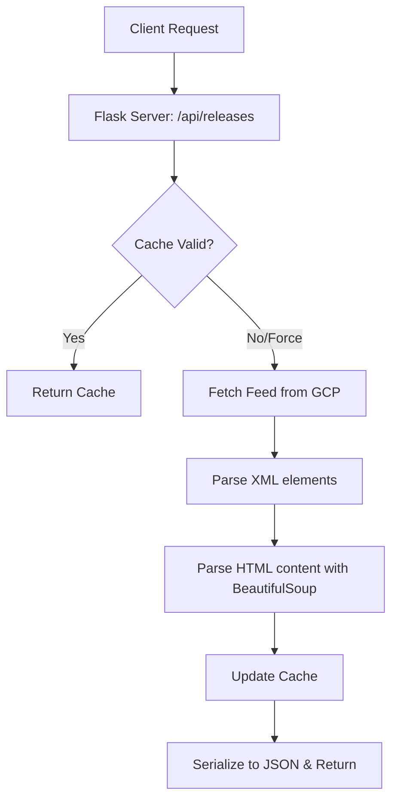
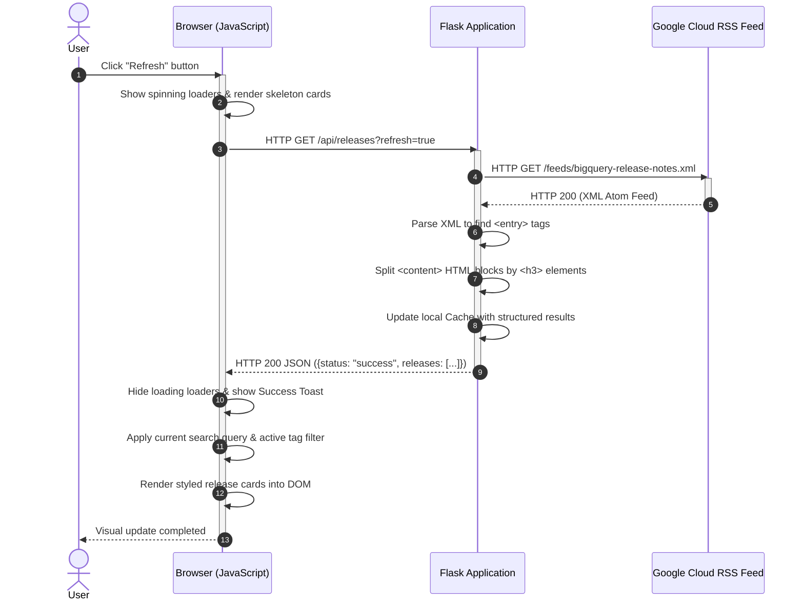

# BigQuery Release Notes Application: Architecture & Flow Guide

This document provides a detailed breakdown of the BigQuery Release Notes tracker application. It covers key features, splits responsibilities between server and client, and walks through a complete request-response flow with a sequence diagram.

---

## 🌟 Main Features

1. **Daily Feed Deconstruction**: The official BigQuery release notes RSS feed groups a whole day's updates into a single feed item. The app splits these into individual, fine-grained updates (by parsing `<h3>` tags) so users can focus on, copy, or tweet specific changes.
2. **Double-Pass Filtering**: Combines client-side text searching (case-insensitive checks on date, title, and content) with tag-based filters (`Feature`, `Changed`, `Issue`, `Deprecated`).
3. **Smart Tweet Composer**: Ensures tweets fit under X's (formerly Twitter) 280-character limit. It handles URLs correctly by simulating X's actual behavior (allocating exactly 23 characters for links regardless of their actual length) and adjusts the draft in real time.
4. **Resilient Offline Fallback**: Caches feed responses in-memory for 10 minutes. If the official Google feed goes offline, the server continues to serve the last-cached version seamlessly.

---

## 🖥️ Server-Side Architecture (Python Flask)

The backend is implemented in [app.py](file:///Users/rashid/31_upskillingAgenticAI/1_5dayAIAgentsIntensiveVibeCodingCourseWithGoogle/agy-cli-projects/bq-releases-notes/app.py) and is responsible for data acquisition, XML/HTML translation, and caching.

### Key Components

* **Feed Scraper**: Utilizes Python's `requests` library to fetch the Atom XML feed from GCP.
* **Atom XML ElementTree Extractor**: Identifies and parses nodes inside the Atom namespace `{http://www.w3.org/2005/Atom}` (such as `title`, `updated`, `id`, `link`, and `content`).
* **BeautifulSoup Splitting Engine ([parse_entry_content](file:///Users/rashid/31_upskillingAgenticAI/1_5dayAIAgentsIntensiveVibeCodingCourseWithGoogle/agy-cli-projects/bq-releases-notes/app.py#L26-L70))**:
  - The raw XML feed contains an HTML blob containing multiple sibling tags (e.g. `<h3>Feature</h3>
...
<h3>Issue</h3>
...
`).
  - The splitting engine iterates through these HTML nodes. When it hits an `<h3>` element, it starts a new update record, collecting all subsequent paragraphs, links, and lists until the next `<h3>` element is found.
* **In-Memory Cache Cache**: A simple dict `_cache` mapping the last fetch timestamp and list of parsed updates.

---

## 🎨 Client-Side Architecture (Vanilla HTML, CSS, JS)

The frontend uses zero external JavaScript libraries to maximize performance and maintain a lightweight code footprint.

### Key Components

* **HTML Structure ([index.html](file:///Users/rashid/31_upskillingAgenticAI/1_5dayAIAgentsIntensiveVibeCodingCourseWithGoogle/agy-cli-projects/bq-releases-notes/templates/index.html))**: Semantic elements (`<header>`, `<section>`, `<main>`, `<article>`, `<footer>`) styling a glassmorphic dashboard container.
* **Visual Token System ([style.css](file:///Users/rashid/31_upskillingAgenticAI/1_5dayAIAgentsIntensiveVibeCodingCourseWithGoogle/agy-cli-projects/bq-releases-notes/static/css/style.css))**: Implemented entirely via CSS Custom Properties. Defines distinct colors, backgrounds, borders, glow layers, and animations (such as the loading skeleton shimmer and toast sliding transitions).
* **State Manager ([app.js](file:///Users/rashid/31_upskillingAgenticAI/1_5dayAIAgentsIntensiveVibeCodingCourseWithGoogle/agy-cli-projects/bq-releases-notes/static/js/app.js))**:
  - Maintains a single state object `appState` holding all fetched releases, filtered releases, search inputs, active category filters, and modal properties.
  - Dynamically updates the DOM on state change using standard DOM APIs.
* **Tweet Character Parser ([updateTweetCharCounter](file:///Users/rashid/31_upskillingAgenticAI/1_5dayAIAgentsIntensiveVibeCodingCourseWithGoogle/agy-cli-projects/bq-releases-notes/static/js/app.js#L380-L417))**:
  - Employs a regex `/(https?:\/\/[^\s]+)/g` to match links in the composer textarea.
  - Temporarily replaces matched links with a 23-character dummy string to calculate the exact X-compliant length.
  - Enables or disables the "Post on X" button and colors the count indicator based on the budget.

---

## 🔄 Sample Request/Response Flow: Refreshing Updates

Here is what happens step-by-step when a user clicks the **Refresh** button on the client interface:

### Step Breakdown

1. **User Action**: The user clicks the **Refresh** button in the header.
2. **Client UI State Update**: The click handler triggers. It immediately disables the refresh button, replaces the static refresh arrow with a rotating SVG spinner, and replaces all active cards with 3 glowing loading skeletons animating a sliding background shimmer.
3. **API Request**: The client sends a fetch request to `/api/releases?refresh=true`. The query parameter tells the Flask server to bypass the 10-minute cache and fetch a fresh feed.
4. **Backend Fetching**: The Flask server requests the raw XML feed from Google Cloud.
5. **Feed Response**: Google's servers return the XML payload.
6. **Backend Processing (XML & HTML)**:
   - `app.py` parses the XML file structure.
   - For each feed entry, it extracts the HTML content and hands it to `BeautifulSoup` to split paragraphs into specific records.
   - It hashes a unique ID for each card (e.g. `June_15_2026_feature_2`) and maps it to a direct link targeting the date anchor on the official release documentation page.
7. **Cache Refresh**: The server updates its memory dict with the fresh data and timestamps.
8. **JSON Response**: The server serializes the structured list into a JSON response and returns it to the client with a `200 OK` status.
9. **Client Processing**:
   - The frontend JavaScript receives the JSON.
   - It hides the skeletons and stops the spinners.
   - It triggers the [applyFilters](file:///Users/rashid/31_upskillingAgenticAI/1_5dayAIAgentsIntensiveVibeCodingCourseWithGoogle/agy-cli-projects/bq-releases-notes/static/js/app.js#L236-L260) function to evaluate the active search text and type tag filters, making sure only matching cards are shown.
   - It updates the counts inside the status bar and renders the HTML cards.
10. **Final Feedback**: A slide-up toast notification displays *"Release notes refreshed!"* to confirm completion.
